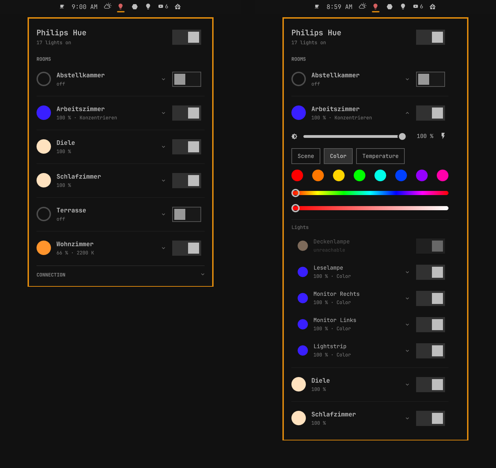
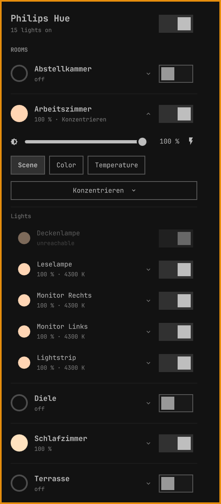
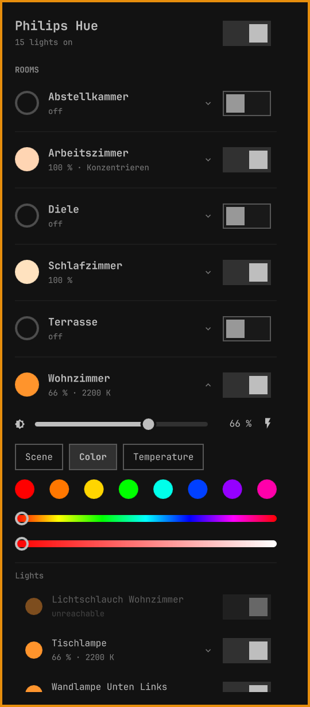
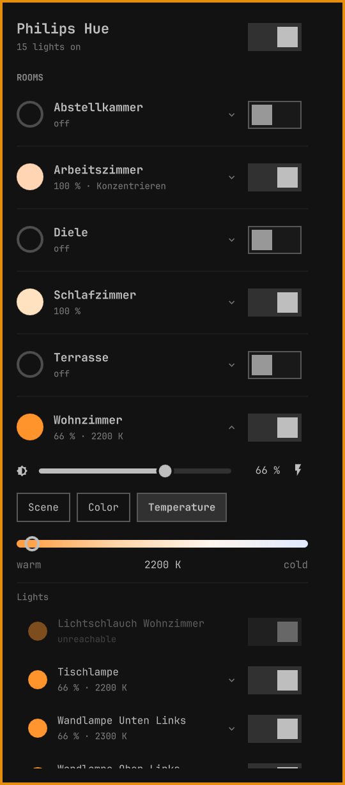

# Omarchy Light Control for Hue

[](https://github.com/mahype/omarchy-light-control-hue/actions/workflows/ci.yml)
[](manifest.json)
[](LICENSE)
[](https://omarchy.org)
[](https://developers.meethue.com/)
[](#what-it-stores-and-where-it-connects)
[](#what-it-stores-and-where-it-connects)
[](#requirements)

Control your Philips Hue lights from the Omarchy bar: rooms, zones, scenes,
colors, color temperature, single lamps and smart plugs. The plugin talks to
the Hue bridge on your local network — no cloud account, no polling. Changes
made elsewhere (Hue app, wall switches, automations) show up instantly through
the bridge's event stream.



## Features

- **Bar icon** shows whether any light is on and marks an unreachable bridge.
- **Rooms and zones** with switch, brightness and a status line such as
  `65 % · Relax` or `80 % · 2700 K`. The color dot shows the current light color.
- **Scene · Color · Temperature** per room, zone or lamp. Scenes come as a
  dropdown, colors as quick swatches plus hue and saturation sliders, color
  temperature as a warm-to-cold slider in Kelvin. Switching the tab only
  changes the view; nothing is sent until you pick a value.
- **Brightness** keeps a running scene's proportions by recalling the scene at
  the new level.
- **Blink** (flash button) to find a room or lamp.
- **Single lamps** inside each room, each with its own controls.
- **Smart plugs** in their own section.
- **All lights** switch in the panel header.
- **Live updates:** changes from the Hue app, switches or automations appear
  instantly through the bridge's event stream.
- **English and German:** the UI follows the system language.
- Controls only appear when the lamps support them.

Unfold a room for its controls. Scene, Color and Temperature are exclusive,
brightness works with all of them:

<table>
  <tr>
    <th width="33%">Scene</th>
    <th width="33%">Color</th>
    <th width="33%">Temperature</th>
  </tr>
  <tr>
    <td valign="top"></td>
    <td valign="top"></td>
    <td valign="top"></td>
  </tr>
</table>

## Requirements

- Omarchy with the Quickshell-based `omarchy-shell`
- A Philips Hue bridge (v2, square) on the same network
- A Secret Service provider for the bridge key (GNOME Keyring is the Omarchy
  default)

Everything else ships with Omarchy: `curl`, `openssl`, `secret-tool` and
`avahi-browse`. Nothing is built, bundled as a binary or downloaded.

## Installation

```bash
omarchy plugin add https://github.com/mahype/omarchy-light-control-hue.git --enable
```

Then connect your bridge:

1. Click the light bulb in the bar.
2. Click **Find Hue bridge**, then **Select** next to your bridge (or enter its
   IP address).
3. Click **Pair** and press the round link button on top of the bridge within
   30 seconds.

To update later, run `omarchy plugin update io.github.mahype.omarchy-light-control-hue`.

## Remove

Click **Disconnect bridge** under *Connection* in the panel (this deletes the
stored key), then:

```bash
omarchy plugin remove io.github.mahype.omarchy-light-control-hue
rm -rf ~/.config/omarchy-light-control-hue   # bridge selection
```

The Hue bridge keeps a registration entry named
`omarchy-light-control-hue#desktop`; remove it in the Hue app if you like.
Your lights, rooms and scenes are not touched.

## What it stores and where it connects

| What | Where |
|---|---|
| Bridge ID, address and name | `~/.config/omarchy-light-control-hue/config.json` (directory mode 0700) |
| Hue application key and client key | Secret Service, `service=io.github.mahype.omarchy-light-control-hue`, `bridge=<bridge id>` |
| Hue bridge (HTTPS 443) | your local network |
| `discovery.meethue.com` | only when mDNS finds no bridge |

- **Verified TLS.** Every request is checked against Signify's two published
  Hue root certificates (`certs/`, see [certs/README.md](certs/README.md)) with
  the bridge ID as TLS name; the address only resolves that name. A bridge
  entered by address must present such a certificate before its ID is used.
- **Keys stay out of sight.** curl reads each request, including the key, from
  stdin (`curl -K -`), so it never appears in the process list, the config
  file or logs.
- **External programs:** `curl`, `openssl`, `secret-tool` and `avahi-browse`,
  always called with argument arrays, never through a shell.
- No installer, no services, no downloads. No sudo or pkexec is required.

## Keyboard and scripting

The widget registers an IPC target. `expand` opens the panel with a room or
zone unfolded; its second argument picks the tab (`scene`, `color`,
`temperature`, or `""` for the current one):

```bash
omarchy-shell io.github.mahype.omarchy-light-control-hue toggle
omarchy-shell io.github.mahype.omarchy-light-control-hue expand "Living room" color
omarchy-shell io.github.mahype.omarchy-light-control-hue allOff
```

## Development

| Path | Purpose |
|---|---|
| `shell/Service.qml` | Owns config, credentials, the curl queue and the event stream |
| `shell/HueBridge.js` | Hue bridge protocol shared with [Omarchy Light Sync for Hue](https://github.com/mahype/omarchy-lightsync); keep both copies identical |
| `shell/HueHome.js` | Raw CLIP v2 resources → rooms, scenes, lights; color math |
| `shell/Model.js` | Panel logic and English/German strings |
| `shell/Panel.qml`, `shell/*Row.qml`, `shell/LightModes.qml` | Bar popup and its rows |
| `shell/BarWidget.qml` | Bar icon and IPC target |
| `certs/` | Signify's Hue root certificates |
| `tests/` | Unit tests and manifest check |

Run the checks (Node 22+, jq):

```bash
bash tests/check-manifest.sh
node --test tests/*.test.js
```

Link a checkout into Omarchy:

```bash
ln -s "$PWD" ~/.config/omarchy/plugins/io.github.mahype.omarchy-light-control-hue
omarchy-shell shell rescanPlugins
omarchy plugin enable io.github.mahype.omarchy-light-control-hue
```

Omarchy's file watcher does not follow symlinks, so run
`omarchy restart shell` after changing code.

## Roadmap

- Optional remote control through the Hue cloud when away from home — strictly
  an add-on; the local bridge stays the primary path.
- Hiding and reordering rooms.

## License

MIT — see [LICENSE](LICENSE).

Philips and Hue are trademarks of Signify. This is an independent community
project, not affiliated with or endorsed by Signify.
