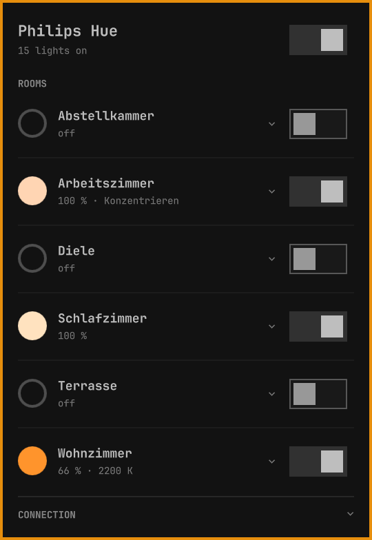

# Omarchy Light Control for Hue

[](https://github.com/mahype/omarchy-light-control-hue/actions/workflows/ci.yml)
[](manifest.json)
[](LICENSE)
[](https://omarchy.org)
[](https://developers.meethue.com/)
[](#what-it-stores-and-where-it-connects)
[](#what-it-stores-and-where-it-connects)

Control your Philips Hue lights from the Omarchy bar: rooms, zones, scenes,
colors, color temperature, single lamps and smart plugs. The plugin talks to
the Hue bridge on your local network — no cloud account, no polling. Changes
made elsewhere (Hue app, wall switches, automations) show up instantly through
the bridge's event stream.

<table>
  <tr>
    <th width="25%">Rooms at a glance</th>
    <th width="25%">Scenes</th>
    <th width="25%">Colors</th>
    <th width="25%">Color temperature</th>
  </tr>
  <tr>
    <td valign="top"></td>
    <td valign="top"></td>
    <td valign="top"></td>
    <td valign="top"></td>
  </tr>
</table>

## Features

- **Bar icon** shows whether any light is on and marks an unreachable bridge.
- **Rooms and zones** with switch, brightness and a status line such as
  `65 % · Relax` or `80 % · 2700 K`. The color dot shows the current light color.
- **Scene · Color · Temperature** per room, zone or lamp. Scenes come as a
  dropdown, colors as quick swatches plus hue and saturation sliders, color
  temperature as a warm-to-cold slider in Kelvin. Switching the tab only
  changes the view; nothing is sent until you pick a value.
- **Brightness** keeps a running scene's proportions by recalling the scene at
  the new level.
- **Blink** (flash button) to find a room or lamp.
- **Single lamps** inside each room, each with its own controls.
- **Smart plugs** in their own section.
- **All lights** switch in the panel header.
- Controls only appear when the lamps support them.

## Requirements

- Omarchy with the Quickshell-based `omarchy-shell`
- A Philips Hue bridge (v2, square) on the same network
- Rust toolchain (`cargo`) to build the helper once: `omarchy pkg add rust`
- A Secret Service provider for storing the bridge key (GNOME Keyring is the
  Omarchy default)

## Install

```bash
omarchy plugin add https://github.com/mahype/omarchy-light-control-hue.git
~/.config/omarchy/plugins/io.github.mahype.omarchy-light-control-hue/install.sh
omarchy plugin enable io.github.mahype.omarchy-light-control-hue --section right
```

`install.sh` builds the `omarchy-light-control-hue` helper from this
repository and installs it to `~/.local/bin`. It runs as your user and
changes no Omarchy configuration. The plugin itself never builds, downloads
or installs anything.

Then click the Hue icon in the bar:

1. **Find Hue bridge** (mDNS, falling back to Signify's discovery service),
   or enter the bridge's IP address.
2. **Pair**, then press the round link button on the bridge within 30 seconds.

## Update

```bash
omarchy plugin update io.github.mahype.omarchy-light-control-hue
~/.config/omarchy/plugins/io.github.mahype.omarchy-light-control-hue/install.sh
```

## Remove

```bash
~/.config/omarchy/plugins/io.github.mahype.omarchy-light-control-hue/uninstall.sh
omarchy plugin remove io.github.mahype.omarchy-light-control-hue
```

`uninstall.sh` deletes the stored bridge key from the Secret Service,
`~/.config/omarchy-light-control-hue` and the helper binary. The Hue bridge
keeps a registration entry named `omarchy-light-control-hue#desktop`; remove it
in the Hue app if you like. Your lights, rooms and scenes are not touched.

## What it stores and where it connects

| What | Where |
|---|---|
| Bridge ID, address and name | `~/.config/omarchy-light-control-hue/config.json` |
| Bridge application key | Secret Service, service `io.github.mahype.omarchy-light-control-hue` |
| Network | Your Hue bridge over HTTPS; `discovery.meethue.com` only when searching for a bridge and none answers via mDNS |

HTTPS connections are verified against Signify's published Hue root
certificates, with the bridge ID as the TLS name. The two public CA
certificates in `src/` (`hue-root-bridge.pem`, `hue-root-ca-01.pem`) come from
Signify's developer documentation on
[using HTTPS](https://developers.meethue.com/develop/application-design-guidance/using-https/)
and [Hue bridge certificates](https://developers.meethue.com/develop/application-design-guidance/hue-bridge-certificates/).

## Keyboard and scripting

The widget registers an IPC target. `expand` opens the panel with a room or
zone unfolded; its second argument picks the tab (`scene`, `color`,
`temperature`, or `""` for the current one):

```bash
omarchy-shell io.github.mahype.omarchy-light-control-hue toggle
omarchy-shell io.github.mahype.omarchy-light-control-hue expand "Living room" ""
omarchy-shell io.github.mahype.omarchy-light-control-hue expand "Living room" color
omarchy-shell io.github.mahype.omarchy-light-control-hue allOff
```

The helper also works on its own:

```bash
omarchy-light-control-hue discover
omarchy-light-control-hue connect 192.168.1.20
omarchy-light-control-hue pair
omarchy-light-control-hue watch      # JSON state stream; requests on stdin
omarchy-light-control-hue set group <grouped_light id> --on true --brightness 60
omarchy-light-control-hue set light <light id> --color ff8800
omarchy-light-control-hue scene <scene id> --brightness 50
omarchy-light-control-hue identify light <light id>
omarchy-light-control-hue all-off
```

## Development

```bash
cargo test && cargo clippy --all-targets
node tests/model.test.js
bash tests/check-manifest.sh
omarchy plugin validate .
```

A development checkout uses `target/release/omarchy-light-control-hue` when no
installed helper exists. After changing QML files, restart the shell with
`omarchy-restart-shell`.

## Roadmap

- Optional remote control through the Hue cloud when away from home — strictly
  an add-on; the local bridge stays the primary path.
- Hiding and reordering rooms.

## License

MIT — see [LICENSE](LICENSE).

Philips and Hue are trademarks of Signify. This is an independent community
project, not affiliated with or endorsed by Signify.
